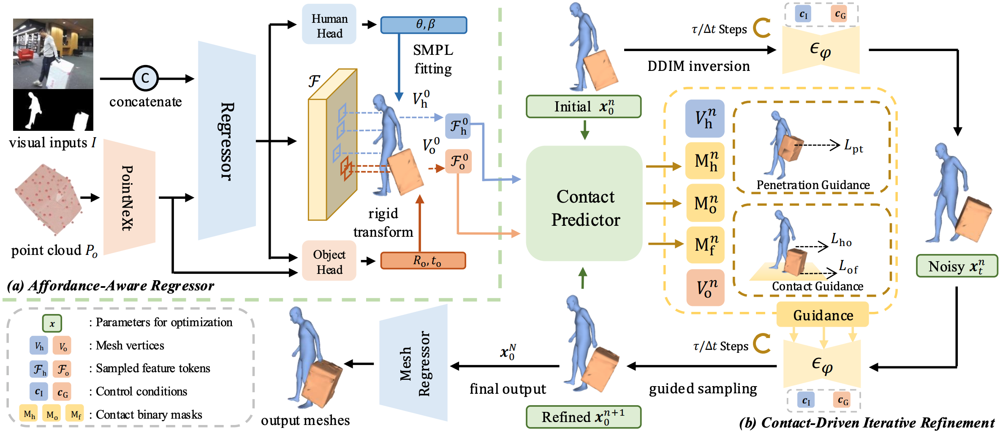

# ScoreHOI: Physically Plausible Reconstruction of Human-Object Interaction via Score-Guided Diffusion (ICCV 2025)
*[Ao Li](https://rammusleo.github.io/), [Jinpeng Liu](https://moonsliu.github.io/), [Yixuan Zhu](https://eternalevan.github.io/), [Yansong Tang](https://andytang15.github.io/)*
----
[**[Arxiv Paper]**](https://arxiv.org/abs/2509.07920)

The repository contains the official implementation for the paper "ScoreHOI: Physically Plausible Reconstruction of Human-Object Interaction via Score-Guided Diffusion" (ICCV 2025).

ScoreHOI is an innovative framework for <ins>**human-object interaction reconstruction**</ins> that   effectively incorporates physical constraints during the sampling process, providing physically plausible reconstruction results. 

## 📋 To-Do List

- [ ] Quick Demo. (Coming Soon! Will be in no longer than 2 days)
- [ ] Release model and inference code.
- [ ] Release code for training dataloader.

## 💡 Pipeline



## 😀Quick Start
### ⚙️ 1. Installation

We recommend you to use an [Anaconda](https://www.anaconda.com/) virtual environment. If you have installed Anaconda, run the following commands to create and activate a virtual environment.
``` bash

conda create -n scorehoi python=3.9
conda activate scorehoi 

# Install PyTorch
pip install torch==2.0.0 torchvision==0.15.1 torchaudio==2.0.1 --index-url https://download.pytorch.org/whl/cu118

# Other requirements
pip install -r requirements.txt
```

### 💁 2. Quick Demo

### 💾 3. Data Preparation

<!-- We prepare the data in a samilar way as [3DCrowdNet](https://github.com/hongsukchoi/3DCrowdNet_RELEASE) & [JOTR](https://github.com/hongsukchoi/3DCrowdNet_RELEASE/blob/main/assets/directory.md). Please refer to [here](https://github.com/hongsukchoi/3DCrowdNet_RELEASE/blob/main/assets/directory.md) for *dataset*, *SMPL model*, *VPoser model*. 

For 3DPW-OC and 3DPW-PC, we apply the same input key-points annotations as [JOTR](https://github.com/hongsukchoi/3DCrowdNet_RELEASE/blob/main/assets/directory.md). Please refer to [3DPW-OC](https://drive.google.com/file/d/1IPE8Yw7ysd97Uv6Uw24el1yRs2r_HtCR/view?usp=sharing) & [3DPW-PC](https://drive.google.com/file/d/1xzZvUj1lR1ECbzUI4JOooC_r2LF6Qs5m/view?usp=sharing).

**For evaluation only, you can just prepare 3DPW dataset (images and annotations) and the joint regressors**, we provide the directory structure below.

```
|-- common
|   |-- utils
|   |   |-- human_model_files
|   |   |-- smplpytorch
|-- data 
|   |-- J_regressor_extra.npy 
|   |-- annotations
|   |   |-- crowdpose.pkl
|   |   |-- muco.pkl
|   |   |-- human36m.pkl
|   |   |-- mscoco.pkl
|   |-- 3DPW
|   |   |-- 3DPW_latest_test.json
|   |   |-- 3DPW_oc.json
|   |   |-- 3DPW_pc.json
|   |   |-- 3DPW_validation_crowd_hhrnet_result.json
|   |   |-- imageFiles
|   |   |-- sequenceFiles
|   |-- CrowdPose
|   |   |-- images
|   |   |-- annotations
|   |-- MuCo
|   |   |-- images
|   |   |-- annotations
|   |-- Human36M  
|   |   |-- images
|   |   |-- annotations
|   |   |-- J_regressor_h36m_correct.npy
|   |-- MSCOCO  
|   |   |-- images
|   |   |-- annotations
|   |   |-- J_regressor_coco_hip_smpl.npy
``` -->

### 📊 4. Evaluation

<!-- You can evaluate DPMesh use following commands:

```bash
CUDA_VISIBLE_DEVICES=0 \
torchrun \
--master_port 29591 \
--nproc_per_node 1 \
eval.py \
--cfg ./configs/main_train.yml \
--exp_id="main_train" \
--distributed \
```

The evaluation process can be done with one Nvidia GeForce RTX 4090 GPU (24GB VRAM). You can use more GPUs by specifying the GPU ids. -->

### 🔧 5. Training

<!-- Instead of computing the 3D joints coordinates during training process, we prepare these annotations before and save them into `.pkl` files, please refer to [this link](https://cloud.tsinghua.edu.cn/d/1d6cd3ee30204bb59fce/) for our annotations. 

Now you can run `train.py` to train our model:
```bash
CUDA_VISIBLE_DEVICES=0,1,2,3,4,5,6,7 \
torchrun \
--master_port 29592 \
--nproc_per_node 8 \
train.py \
--cfg ./configs/main_train.yml \
--exp_id="train" \
--distributed \
``` -->

## 🫰 Acknowledgments

We would like to express our sincere thanks to [CONTHO](https://github.com/dqj5182/CONTHO_RELEASE.git), for our code is partially borrowing from them.

We also thank [CHORE](https://github.com/xiexh20/CHORE), [InterCap](https://github.com/YinghaoHuang91/InterCap/tree/master) for their high quailty datasets.


## ❓ Q & A
1. If you find an error as below, please refer to [this link](https://stackoverflow.com/questions/65637222/runtimeerror-subtraction-the-operator-with-a-bool-tensor-is-not-supported) for help.
```bash
RuntimeError: Subtraction, the `-` operator, with a bool tensor is not supported. If you are trying to invert a mask, use the `~` or `logical_not()` operator instead.
```


## 🔖 Citation
```
@article{li2025scorehoi,
  title={ScoreHOI: Physically Plausible Reconstruction of Human-Object Interaction via Score-Guided Diffusion},
  author={Li, Ao and Liu, Jinpeng and Zhu, Yixuan and Tang, Yansong},
  journal={arXiv preprint arXiv:2509.07920},
  year={2025}
}
```

## 🔑 License

This code is distributed under an [MIT LICENSE](./LICENSE).
